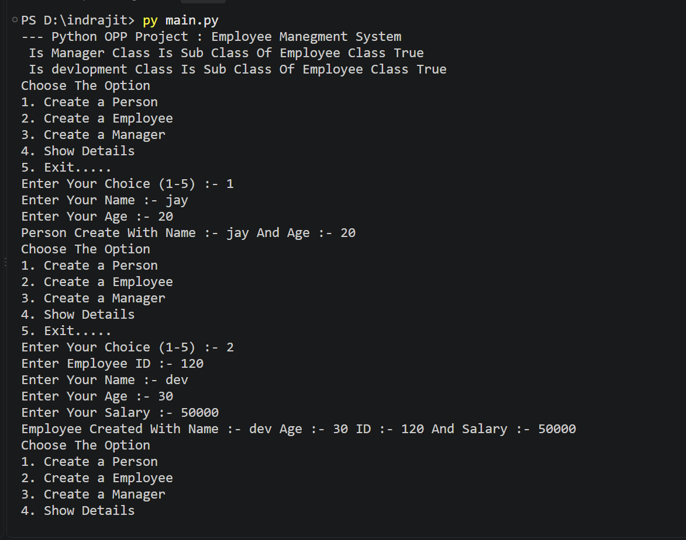

🐍 Python OOP — Employee Management System

A simple Employee Management System built with Python to demonstrate fundamental Object-Oriented Programming (OOP) concepts.

📌 Project Description

This is a menu-driven Employee Management System created using Python.

The project demonstrates important OOP concepts such as:

Classes and Objects

Constructors

Encapsulation

Inheritance

Method Overriding

Private Attributes

Getters and Setters

super()

issubclass()

Menu-driven programming

🛠️ Technologies Used

Python 3

Object-Oriented Programming (OOP)

📂 Project Structure
Employee-Management-System/
│
├── main.py
├── output.png
└── README.md

 🖼️  Output Screenshot
 
    

👨‍💻 Classes
1. Employee

Employee is the base class of the project.

It contains:

Employee ID

Name

Age

Salary

Private attributes:

self.__Employee_id
self.__salary

The class provides getter and setter methods for the private attributes.

Methods:

display()

set_id()

set_salary()

get_id()

get_salary()

2. Manager

Manager inherits from the Employee class.

class Manager(Employee):

Additional attribute:

Department

The display() method is overridden to display manager details.

3. Development

The devlopment class inherits from Employee.

class devlopment(Employee):

Additional attribute:

Programming Language

Note: The original class name in the project is devlopment. A better Python naming convention would be Development.

🧠 OOP Concepts Used
Encapsulation

Employee ID and salary are stored as private attributes:

self.__Employee_id
self.__salary

Getter and setter methods are used to access and modify these attributes.

def set_id(self, Employee_id):
    self.__Employee_id = Employee_id

def get_id(self):
    return self.__Employee_id

Inheritance

The Manager and devlopment classes inherit from the Employee class.

class Manager(Employee):

class devlopment(Employee):

Method Overriding

The child classes override the display() method.

Example:

def display(self):
    super().display()

Constructor

The __init__() method is used to initialize object attributes.

def __init__(self, Employee_id=None, name=None, age=None, salary=None):

super()

super() is used to call the constructor or method of the parent class.

super().__init__(Employee_id, name, age, salary)

issubclass()

The program checks whether Manager and devlopment are subclasses of Employee.

issubclass(Manager, Employee)

issubclass(devlopment, Employee)

📋 Menu Options

When the program starts, the following menu is displayed:

Choose The Option
1. Create a Person
2. Create a Employee
3. Create a Manager
4. Show Details
5. Exit.....

1️⃣ Create a Person

Creates an Employee object with:

Name

Age

2️⃣ Create an Employee

Creates an employee with:

Employee ID

Name

Age

Salary

3️⃣ Create a Manager

Creates a manager with:

Employee ID

Name

Age

Salary

Department

4️⃣ Show Details

Allows the user to display:

Person details

Employee details

Manager details

5️⃣ Exit

Exits the program.

▶️ How to Run

Make sure Python 3 is installed on your computer.

Clone the repository:

git clone YOUR_GITHUB_REPOSITORY_URL

Go to the project folder:

 Employee-Management-System

Run the Python program:

python main.py

💻 Example Output
--- Python OPP Project : Employee Manegment System

Is Manager Class Is Sub Class Of Employee Class True
Is devlopment Class Is Sub Class Of Employee Class True

Choose The Option
1. Create a Person
2. Create a Employee
3. Create a Manager
4. Show Details
5. Exit.....

Example employee details:

Employee id is 101
Employee name is Rahul
Employee age is 25
Employee salary is 30000

Example manager details:

Employee id is 102
Employee name is Amit
Employee age is 30
Employee salary is 50000
Manager Department is IT

👨‍💻 Author

INDRAJIT SINH 

